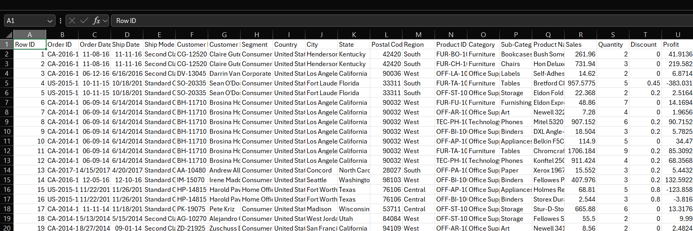
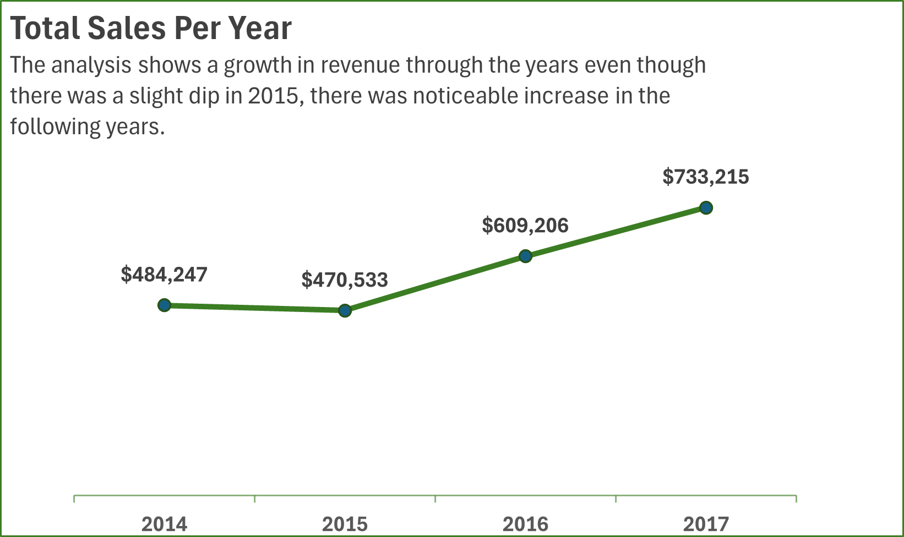
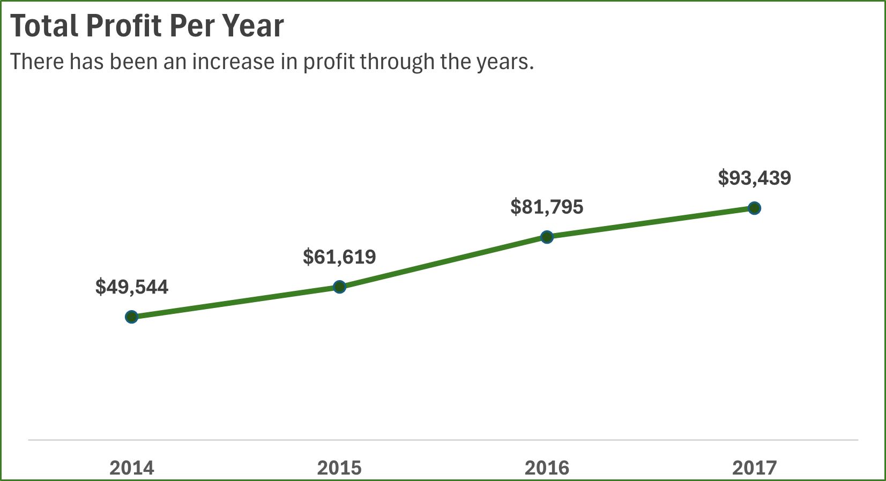

# Super Store Performance Analysis

## Introduction
This is an excel project on sales analysis of a Super Store sales data from **_2014_** to **_2017_**. 
The aim of this project is to come up with important business questions and provide valuable insights to help the company make data driven decisions.

**_Disclaimer_**: _The dataset used does not represent any company, institute, or country. This is a dummy dataset meant to demonstrate my capabilities as a data analyst._

## Business Questions
After taking a close look at the data set, I came up with the following questions I believe would be important to gain insight into the company’s sales performance.
1.	How do total sales compare to the total profit made for each year?
2.	Highlight the total profit and sales figures for each product category and segment
3.	Which are the top 10 states driving the highest sales, and how do they perform in each region?
4.	What is the sales trend like for each month of the year?
5.	What is the total quantity of goods sold across different product categories and segments?
6.	How much does each region contribute to the overall profit percentage?

## Skills Demonstrated
- Data cleaning and management
- Excel formulas and functions
- Pivot tables
- Pivot charts
- Data visualization 

## The Dataset

The data set was downloaded as a CSV file from the internet and imported into an excel worksheet.
This data set contained 9945 rows of information with 21 columns. The data set included different categories of information. 
- **Order Information** consists of _order id_, _order date_, _ship date_ and _ship mode_.
- **Customer Information** consist of _customer id_, _customer name_ and _segment_.
- **Location Information** consists of _country_, _city_, _state, _postal code_ and _region_.
- **Product Information** consists of _product id_, _category_, _subcategory_ and _product name_.
- **Sales Information** consists of _sales price_, _quantity sold_, _discount_ and _profit_.

## Data Cleaning

Firstly, I checked for blanks using the **_countblank_** function and checked for duplicate values using the **_remove duplicates feature_**. The dataset had no duplicates or blanks, so it was a bit easy to work with.

To make the sheet easier to look at, I removed some columns. I removed the row id column as it did not serve any purpose to the data and the transaction already had a unique identifier which is the order id.
I also removed the country column as all transactions were made in the same country.

I also created 2 new columns, the first was **_days to ship_** and filled the column with values gotten from subtracting the order date from the ship date. This is done to know how long each purchase took to ship.
Then, I created an extra column and called it **_profit/loss_** and used the **_ifS_** function on the profit column to locate losses and profit.

Finally, I changed the data types of the columns to match the data in them.

## Business Key Performance Indicators (KPIs)

1.	**Total Sales**: This can is the first most important KPI as it gives insight into how much the company generated during the given time. This was gotten by using the **_sum_** function on the sales column. The company made over **_2 million dollars_** within the given time period.
2.	**Total Profit**: This tells us how much the profit the company made, and this is gotten by using the **_sum_** function on the profit column. The total profit generated was over **_$280,000_**.
3.	**Profit Margin**: This is the percentage the company generates as profit from the total revenue. This is achieved by dividing the total revenue by the total profit. The profit margin is **_12.47%_**. This means that the company made **_12.47%_** from its total revenue.
4.	**Average Profit**: It shows the average profit made per transaction. This is gotten by using the **_average_** function on the profit column. The company had an average profit of **_$28.66_** per transaction.
5.	**Total Items Sold**: This tells us the total number of goods sold within the given period. Over **_37,000_** goods were sold.
6.	**Average Days To Ship**: This indicates the average number of days for an order to arrive at its destination. This was gotten by using the **_average_** function on the days to ship column. It takes about **_4_** days on average for a customer to get their order.
7.	**Count Of Profit/Loss**: This shows how many of the transactions were recorded as profit or as a loss. I used the **_countif_** function on the profit/loss column. There were **_8,058_** transactions that were recorded as profit and **_1,871_** transactions recorded as losses. It is also worth noting that **_65_** transactions were neither profit nor loss.

## Answering The Business Questions
The insights gained with data analysis were done using pivot tables and visualized with pivot charts.
### 1.	How do total sales compare to the total profit made for each year?
The company has demonstrated consistent growth in both sales and profit over the years. Despite a dip in sales in **_2015_**, the profit remained significantly higher than the previous year.

Notably, **_2016_** achieved the highest profit margin of **_13.43%_**.

### 2.	Highlight the total profit and sales figures for each product category and segment.
In terms of product categories, total sales were relatively similar, with technology leading, followed by furniture, and then office supplies. The profit figures, however, showed that technology and office supplies generated **_$146,455_** and **_$122,491_** respectively, while furniture lagged significantly with a profit of just **_$18,451_**.

For customer segments, the Consumer segment had the highest sales, whereas the Home Office segment had the lowest, possibly due to a lower number of customers owning home offices. The profit distribution followed a similar pattern, with the Consumer segment generating the most profit and the Home Office segment the least.

### 3.	Which are the top 10 states driving the highest sales, and how do they perform in each region?
This analysis utilized a slicer to filter by region.

California led in sales and was the top state in the Western region, followed by New York, which topped the Eastern region. Texas ranked third overall and was the highest in the Central region. Florida had the highest sales in the Southern region but was sixth overall.

**_The remaining top 10 states were:_**
- Washington (4th overall, 2nd in the West)
- Pennsylvania (5th overall, 2nd in the East)
- Illinois (7th overall, 2nd in the Central)
- Ohio (8th overall, 3rd in the East)
- Michigan (9th overall, 3rd in the Central)
- Virginia (10th overall, 2nd in the South)

### 4.	What is the sales trend like for each month of the year?
The analysis indicated a decline in sales in February, followed by a slight increase in March. Sales remained steady from April through August, with a noticeable increase in September. Sales dipped slightly in October, then rose again in November and December before decreasing once more in January. November recorded the highest sales in **_2015_** and **_2017_**, December in _**2016**_, and September in _**2014**_.

### 5.	What is the total quantity of goods sold across different product categories and segments?
Office supplies accounted for the highest quantity sold, with over **_22,000_** items representing **_61%_** of the total quantity of goods.

In the customer segment, consumers purchased the most, with over _**19,000_** items sold, making up _**51%**_ of the total quantity.

### 6.	How much does each region contribute to the overall profit percentage?
The Western region contributed the highest percentage of profit at _**38%**_, while the Central region had the lowest contribution at _**14%**_.

## Conclusion And Recomendations.
The company has experienced a consistent increase in both sales and profits over the years, achieving a profit margin of _**12%**_. This indicates solid performance and profitability. Nevertheless, there are opportunities for further improvement. The following recommendations highlight key areas for investigation:

1. **Office Supplies Category:** Despite having the highest quantity of goods sold, the office supplies category has yielded the lowest sales and profit margins. A thorough analysis of the products within this category is advised to understand the underlying causes and identify strategies to enhance sales and profitability.

2. **Regional Sales Disparities:** There is a significant gap in sales performance between the top two states and the other regions. While the top-performing states are major markets, targeted sales strategies should be developed and implemented to boost sales in underperforming states, thereby closing the gap and driving overall growth.

3. **Seasonal Sales Trends:** Notably, there is a marked increase in sales during the last four months of the year, with a significant dip in February. This seasonal variation likely correlates with festive periods. The company should capitalize on this by creating targeted marketing campaigns to attract more customers during peak periods and offering incentives to reward loyal customers.

Thank You😊.

